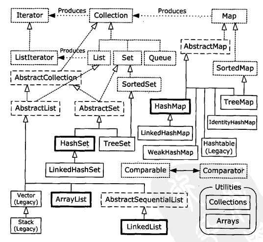

# 容器

## Collections

## List、Set、Map
**类图**

**Set**

* 存储元素必须唯一，需要重载equal方法，确保元素的唯一性
* 不保证顺序（SortedSet保证排序）

|Set|特点|hashCode|equal|Comparable接口|
|--|--|:--:|:--:|:--:|
|*HasheSet|无序、查找快|√|√|×|
|TreeSet|有序|×|√|√|
|LinkedHashSet|插入排序、查询快|√|√|×|

### [Map](http://docs.oracle.com/javase/8/docs/api/java/util/Map.html)

* 存储的key元素必须唯一，需要重载equal方法，确保元素的唯一性
* 不保证key的顺序。
* 注意：Map不是Collection的子接口

**三大视图**

* set of keys               
`Set<K> keySet()`
* collection of values      
`Collection<V> values()`
* set of key-value mappings
`Set<Map.Entry<K,V>> entrySet()`

|Map|排序|hashCode|equal|Comparable接口|
|--|--|:--:|:--:|:--:|
|HashMap|无序、查询快|√|√|×|
|TreeMap|有序|×|√|√|
|LinkedHashMap|插入排序、查询快|√|√|×|

*需要实现的方法或接口是指key对象*
####哈希算法
**查找原理**
1.哈希表（数组）存放需要查找的对象，通过**下标**访问对象，**随机访问**效率高。
2.**下标**，由查找对象的哈希值计算产生。一般是hashCode % size求得。
3.哈希值不要求唯一性且多个对象哈希值指向的下标可能相同，会造成**冲突**。
4.因此哈希表中往往存放的对象是一个**链表**。产生冲突时，遍历链表，通过**顺序访问**，逐一判断要查找的对象。

**负载因子**
负载因子，代表哈希表的负载程度。

* 负载因子越大，哈希表的剩余空间越小，那么就极易产生冲突，链表就会越来越长，查找效率就会越差。
* 负载因子越小，哈希表的剩余空间越大，不易产生冲突，查询效率高，但空间浪费。
* （哈希表的元素个数 / 哈希表容量）> 负载因子时，就会产生扩容。因此负载因子直接影响到哈希表的时空效率。

**hashCode计算方法**
Object.hashCode()：采用对象地址计算哈希值
`int result = 7;    //随便定义一个数字`
`int code = 3;      //随便定义一个数字`
`//遍历需要引入hashCode计算的字段`
`result = result * code + prop;`

注意：

* hashCode依赖的对象（字段），不要易变，否则影响hashCode值变动。容易导致无法通过key查找map的value值。
* hashCode方法，关注生成速度，而不是唯一性。（允许存在冲突）

**equals方法特性**
Object.equals()：为对象地址
* 自反性   a.equals(a) = a.equals(a)
* 对称性   a.equals(b) = b.equals(a)
* 传递性   a.equals(b), b.equals(c) = a.equals(c)
* 一致性   多次调用结果一致
* 任意非空元素equals(null)结果为false