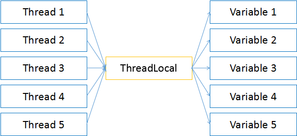

#并发

##1. 线程池

**使用方法**
``` java
public static void main(String[] args) {
    
    ExecutorService exec = Executors.newCachedThreadPool();
    
    exec.execute(new Runnable() {
        //...
    });
    
    exec.submit(new Callable() {
        //...
    }); 
}

```

**优点**
1.分层，Client不用直接执行Task，由Executor作为Client与Task的中间层，由Executor与Task交互。
2.便于管理，Executor管理Task，可以决定执行Task的个数，可以控制Task的生命周期。
3.减少资源消耗，Executor创建的Thread，能够重用（创建新的Thread时，若发现老的Thread可以利用），避免Thread频繁创建。

##2. 资源同步
###Lock

**使用方法**
``` java
public void run(){
    lock.lock();        //锁定资源
    try {
        //同步资源
    } finally {
        lock.unlock();  //释放资源
    }
}
```

**缺点**：代码不够优雅

**优点**：

* `try finally`代码块，产生异常时，finally代码块能够很好地处理资源
* 比起`synchronized`，有良好的细粒度控制
* 能尝试请求锁资源 `lock.tryLock()`

###ThreadLocal
避免资源共享产生的冲突，另一个方法就是消除资源的共享。
ThreadLocal的作用就是为不同线程的使用的同一个变量，创建不同的存放空间。

``` java

public class ThreadLocalHolder {
    
    private static ThreadLocal<Integer> threadLocal;

    public static void main(String[] args) {
        for(int i=0; i<5; i++) {
            new Thread(new Runnable() { 
                
                public void run() {
                    //使用threadLocal对象
                }

            }).start();   
        }
    }

}

```
所有的线程都使用了`threadLocal`对象，但是每个线程持有的变量都是一个独立的副本，相互不影响，就不存在资源共享的问题。



##3. 线程状态
###状态
1. New:已分配系统资源和初始化，等待CPU分配资源，下一个状态 ->Runnable 或者 ->Blocked
2. Runnable:运行状态，下一个状态 ->Blocked 或者 ->Dead
3. Blocked:线程虽然能进入Runnable状态，但是被阻止，需要等待，该状态期间不会做任何操作
4. Dead:获取不到CPU资源，线程运行完毕或线程被interrupted，会使线程处于Dead状态

###Blocked原因
1.  睡眠：调用sleep方法
2.  挂起：调用对象的wait方法，导致线程挂起，直到notify或notifyAll调用后才能运行
3.  I/O阻塞
4.  对象锁：资源对象已经加锁，需等待解锁


